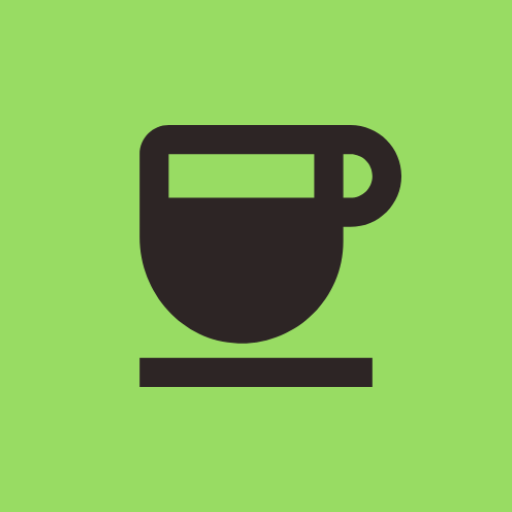
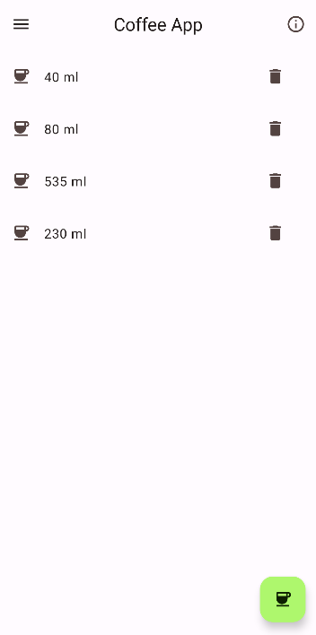
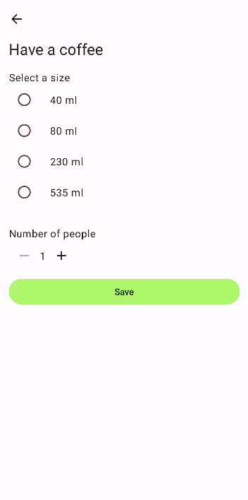
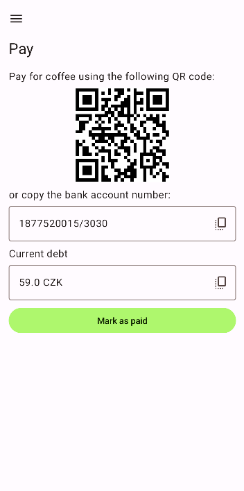
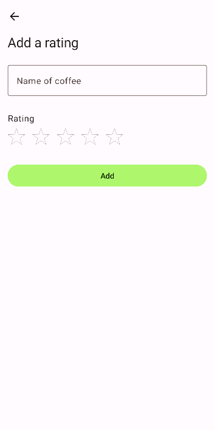
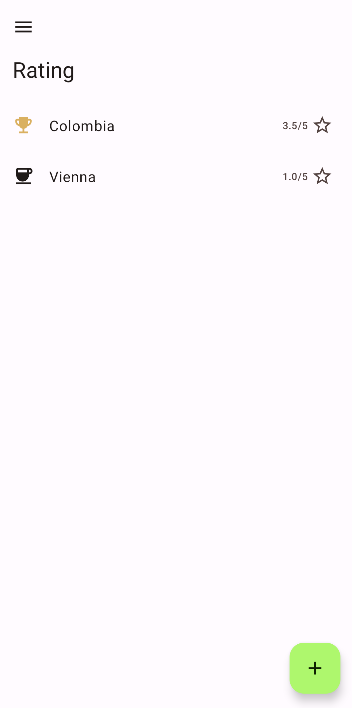
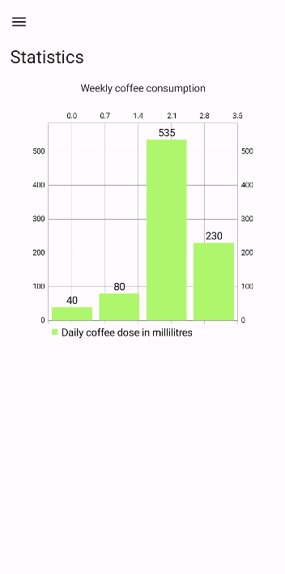

# CoffeeApp

This app was created to track the amount of coffee that everyone drunk from the coffee machine in our lab. The coffee sizes are the sizes of the Nespresso capsules we use. The total price is then calculated and a QR code is generated to pay for the coffee. 

People can also rate the coffee. The rating is then sent to the Firestore, so everyone can see which coffee their colleagues like best.

**App Icon**

**Screenshots**

